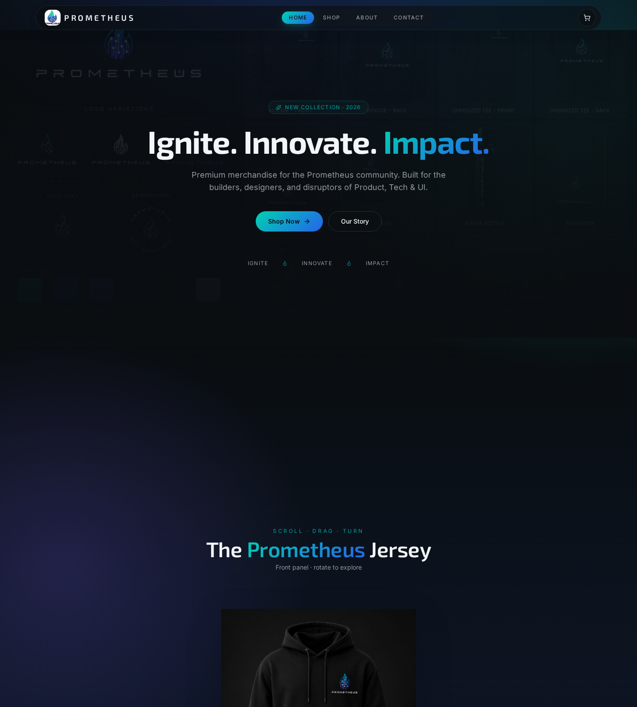
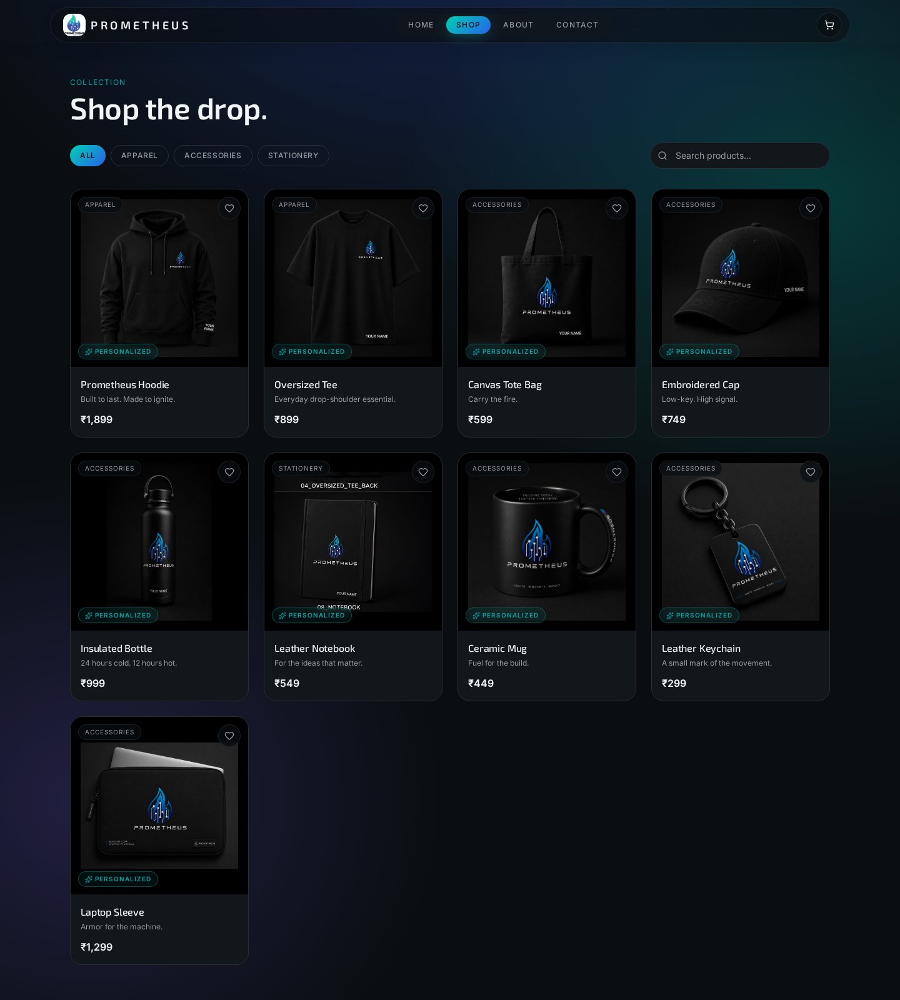
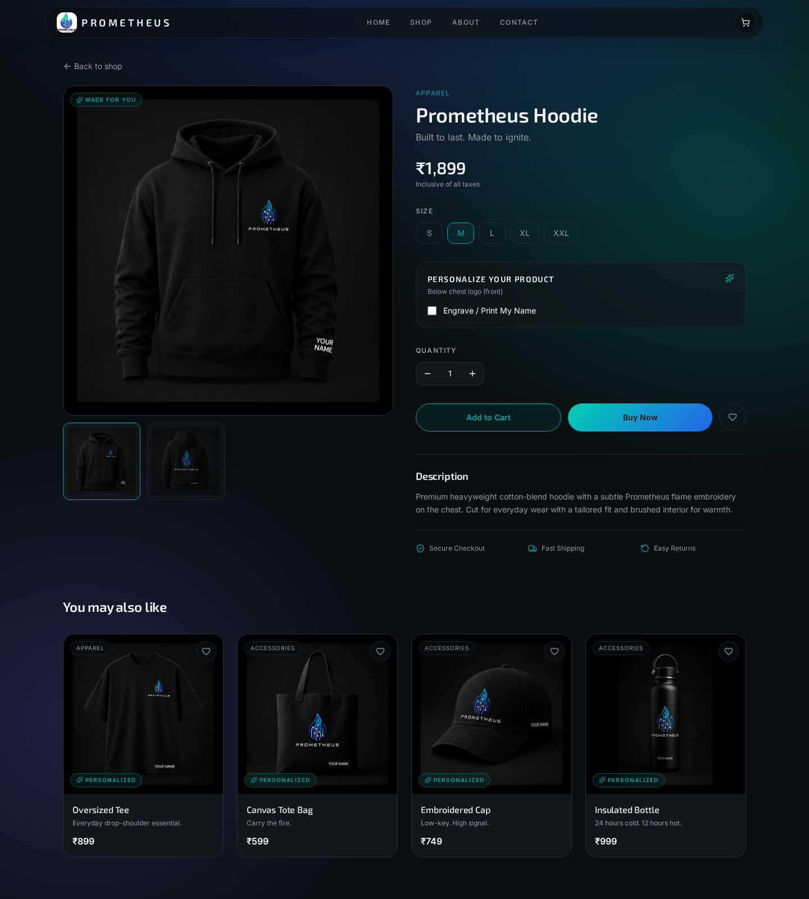
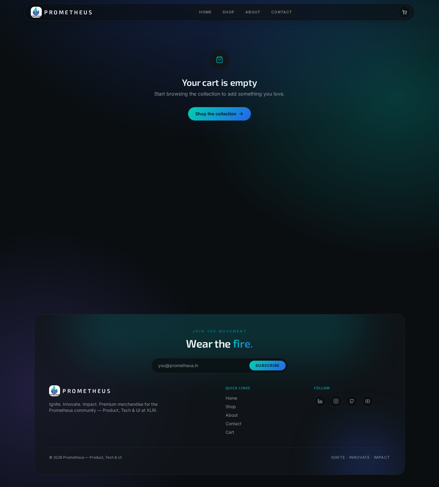
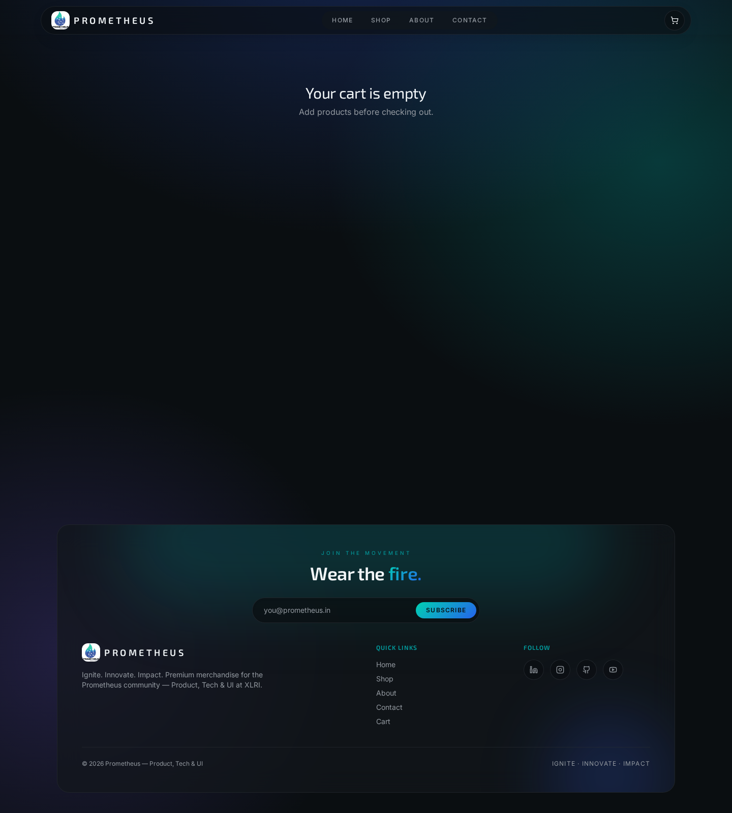
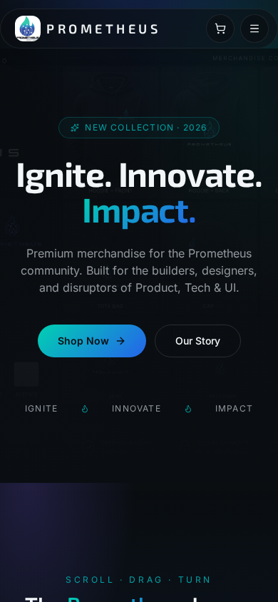
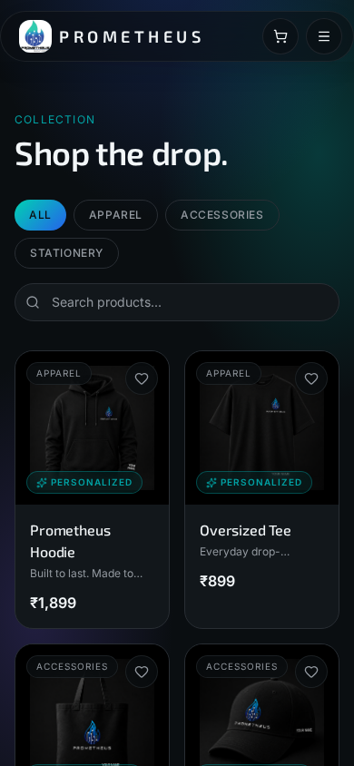

# Prometheus Forge Store

A premium, centralized merchandise storefront designed for **XLRI committees** — bringing scattered committee merch (Google Forms, WhatsApp chaos, manual coordination) into a single, personalized, mobile-first shopping experience.



## Overview

Prometheus Forge Store is a modern e-commerce experience purpose-built for student committees at XLRI. It replaces spreadsheets and DMs with a clean catalogue, live product personalization, a real shopping cart, and a checkout flow that feels closer to Apple than a Google Form.

## Problem Statement

Committee merchandise ordering at XLRI (and most B-schools) currently runs on:

- Scattered Google Forms for each committee
- WhatsApp broadcasts for sizing and quantities
- Manual reconciliation on Excel
- No product previews, no personalization, no order tracking

This leads to poor discoverability, inconsistent branding, delayed deliveries, and hours of committee-side coordination.

## Solution

Prometheus Forge Store provides a single premium storefront that any committee can plug into:

- Centralized merchandise catalogue with rich product mockups
- Live product personalization (name / signature previewed on the product itself)
- Modern shopping experience — cart, wishlist, checkout
- Order confirmation and tracking hooks
- Fully responsive, mobile-first UI
- Architecture ready to scale across multiple committees and events

## Features

- Browse products across Apparel, Accessories, and Stationery
- Rich product detail pages with front/back galleries and size selection
- Real-time personalization preview with validation (18 chars, no emoji/special chars)
- Personalized and "Made for You" badges on eligible products
- Persistent cart and wishlist (localStorage)
- Full checkout flow with order summary
- Premium dark theme, glassmorphism cards, subtle motion, blue focus glow
- Interactive spinning jersey hero on the landing page
- Fully responsive down to 375px

## Tech Stack

- **React 19** + **TypeScript**
- **TanStack Start** (file-based routing, SSR-ready)
- **Vite 7** build tooling
- **Tailwind CSS v4** with semantic design tokens
- **shadcn/ui** component library
- **Radix UI** primitives
- Built and iterated on **[Lovable](https://lovable.dev)**

## Live Demo

- **Production:** https://prometheus-merch-store.lovable.app
- **Preview:** https://prometheus-forge-store.lovable.app

## Screenshots

| Homepage | Product Listing | Product Page |
| :---: | :---: | :---: |
|  |  |  |

| Personalization | Cart | Checkout |
| :---: | :---: | :---: |
|  |  |  |

| Order Confirmation | Mobile Home | Mobile Shop |
| :---: | :---: | :---: |
|  |  |  |

## Folder Structure

```text
prometheus-forge-store/
├── public/                     # Static public assets (robots.txt, favicon)
├── screenshots/                # README screenshots
├── src/
│   ├── assets/                 # Product images, logo, hero art
│   ├── components/             # Reusable UI (Navbar, Footer, ProductCard, JerseySpinner, ui/)
│   ├── hooks/                  # Custom React hooks
│   ├── lib/                    # products.ts (catalogue), store.tsx (cart/wishlist), utils
│   ├── routes/                 # File-based routes (TanStack Start)
│   │   ├── __root.tsx          # App shell + head metadata
│   │   ├── index.tsx           # Landing page
│   │   ├── shop.tsx            # Product listing
│   │   ├── product.$id.tsx     # Product detail + personalization
│   │   ├── cart.tsx            # Cart
│   │   ├── checkout.tsx        # Checkout
│   │   ├── about.tsx
│   │   └── contact.tsx
│   ├── styles.css              # Tailwind v4 theme tokens
│   ├── router.tsx              # Router bootstrap
│   ├── server.ts               # SSR entry
│   └── start.ts                # TanStack Start config
├── components.json             # shadcn/ui config
├── eslint.config.js
├── package.json
├── tsconfig.json
├── vite.config.ts
├── .env.example
├── .gitignore
├── LICENSE
└── README.md
```

## Installation

```bash
# 1. Clone
git clone https://github.com/<your-org>/prometheus-forge-store.git
cd prometheus-forge-store

# 2. Install dependencies (npm, pnpm, yarn, or bun all work)
npm install

# 3. Copy env template
cp .env.example .env

# 4. Start the dev server
npm run dev
```

App runs at **http://localhost:8080** by default.

## Build

```bash
npm run build      # production build
npm run preview    # preview the production build locally
npm run lint       # lint
```

## Future Roadmap

- Committee admin dashboard (add products, set launch windows)
- Inventory management with real-time stock sync
- Razorpay / Stripe payment integration
- Order analytics dashboard for committee heads
- QR-based order pickup at campus counters
- Personalized merchandise recommendations
- Event-scoped merchandise collections (Ensemble, Valhalla, Maars, etc.)
- Role-based access for committee members

## Product Thinking

**Pain points solved**

- Committee merchandise scattered across Google Forms and WhatsApp
- Manual, error-prone ordering and reconciliation
- Zero personalization — same tee for everyone
- Poor discoverability across committees
- Weak, inconsistent branding
- No order status or delivery tracking for students

**Design principles**

- Premium, Apple-like restraint over generic e-commerce noise
- Show the product, not the chrome — big mockups, minimal UI
- Personalization is a first-class feature, not an afterthought
- Mobile-first: most students will order from their phone during a break

## Impact

Prometheus Forge Store creates a scalable digital storefront that **any XLRI committee can adopt in a week**, replacing hours of manual coordination with a single link. It turns committee merch from a logistics problem into a branded experience — the way it should have been all along.

## License

[MIT](./LICENSE)
